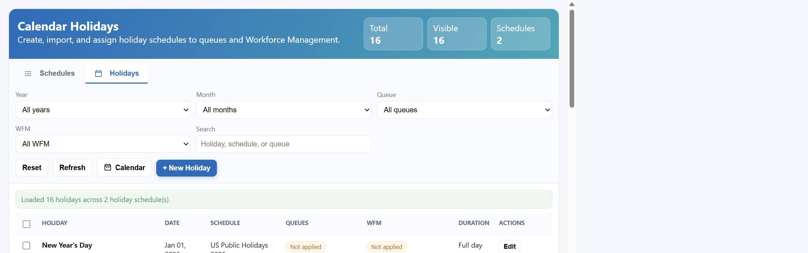
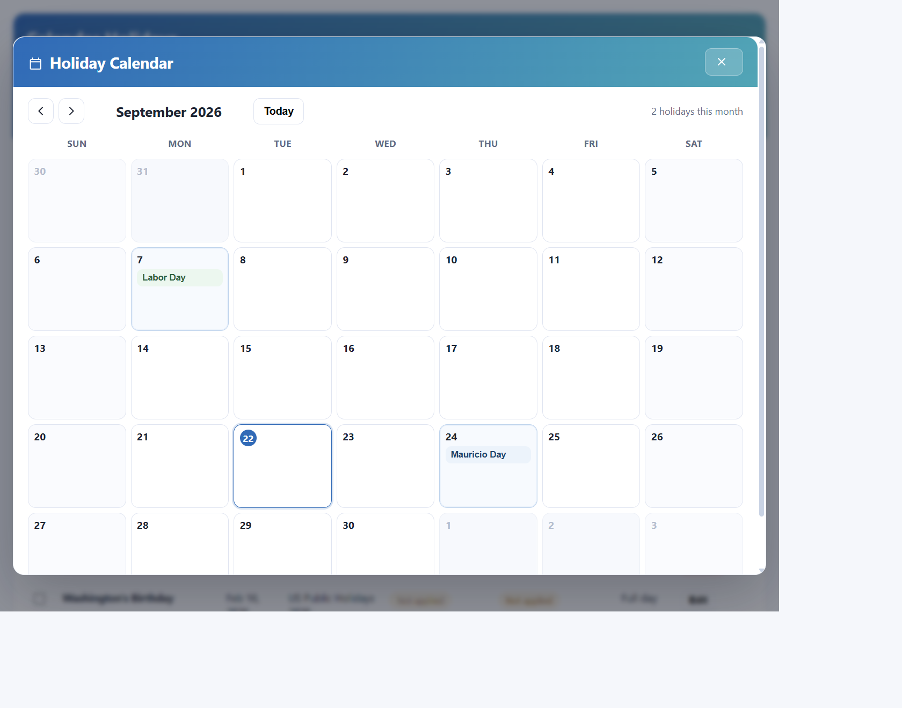
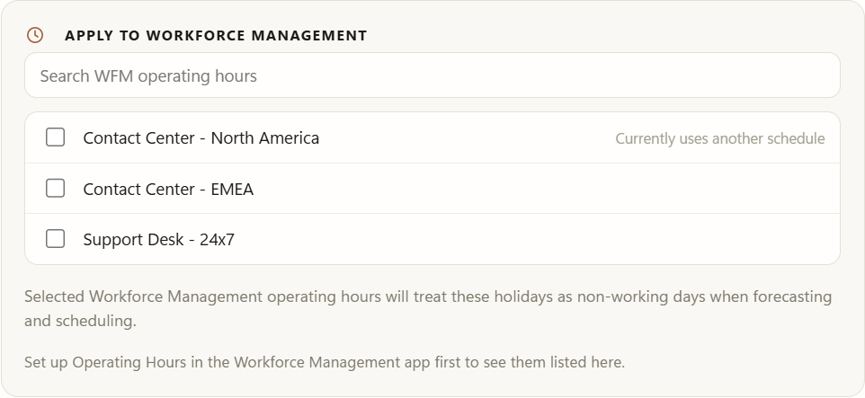

# Queue Holidays Manager for Dynamics 365 Omnichannel



A single, friendly screen to manage the holiday calendars behind your Omnichannel queues and Workforce Management — instead of clicking through Dataverse records one at a time.

## What is this? (in plain English)

If you run customer service queues in Dynamics 365 / Copilot Service, you can tell a queue "we're closed on these dates" using something called a **Holiday Schedule**. The problem is that setting these up out of the box means digging through several different admin screens, creating records by hand, and there's no easy way to just say *"add all the public holidays for Canada this year"*.

This app fixes that. It's a single page, added right inside your Copilot Service Admin Center, where you can:

- 📅 **See every holiday**, across every schedule, in one table — filterable by year, month, or a quick search.
- 🗓️ **Calendar view** — click **Calendar** for a month-by-month grid of your holidays, colour-coded per schedule. Click any holiday to edit it.
- 🌍 **Import a whole country's public holidays** in one click (powered by a free public holiday database, covering 200+ countries), instead of typing each one in by hand.
- ➕ **Add, edit, or delete** individual holidays whenever your business needs change.
- 🗂️ **Create, rename, or delete whole Holiday Schedules**, and see at a glance which queues are using each one.
- 🔗 **Assign a schedule to any queue** (or remove it) without leaving the page.
- 👥 **Apply the same holidays to Workforce Management** — tick the WFM operating hours that should treat those days as non-working when forecasting and scheduling.
- 🧹 **Bulk-select and delete** holidays you don't need anymore, with a confirmation step so nothing gets removed by accident.

No coding, no PowerShell, no digging through solution explorer — just a clean list you click around in.

## How it looks

The app has two tabs:

- **Schedules** — every Holiday Schedule you have, how many holidays and queues are attached to each, and a click-to-expand view of its holidays.
- **Holidays** — every holiday across every schedule, with filters and bulk actions.

Plus a **Calendar** view for seeing the year laid out month by month:



## Technical details

### What it actually is

A single, self-contained HTML/CSS/JavaScript **web resource** for Dataverse. There is no external backend, no Azure Function, and no data leaves your Dataverse environment — every read/write goes straight to the standard Dataverse Web API (`/api/data/v9.2/...`) using the signed-in user's own session and security roles.

### What it reads and writes

| Concept | Dataverse entity | Notes |
|---|---|---|
| Holiday Schedule | `calendar` (`type = 2`, Holiday Schedule) | Created/renamed/deleted directly. |
| Individual holiday | `calendarrule` (child of a `calendar`, `timecode = 2`) | The Dataverse Web API does **not** support updating or deleting a `calendarrule` directly, or querying it outside its parent — this app works around that by rebuilding the parent schedule via a deep-insert whenever a holiday is added, edited, or removed, then re-linking any queues that pointed at the old schedule. |
| Business-hours calendar | `calendar` (`type = 0`) | The object a queue actually points to; its `holidayschedulecalendarid` lookup is what connects it to a Holiday Schedule. |
| Queue → schedule assignment | `queue.msdyn_operatinghourid` → `msdyn_operatinghour.msdyn_calendarid` → business-hours `calendar` → `holidayschedulecalendarid` → Holiday Schedule `calendar` | The app resolves and updates this whole chain when you assign/unassign a schedule. |
| WFM → schedule assignment | `msdyn_wemoperatinghours.msdyn_holidaycalendar` | Workforce Management points at the **same** Holiday Schedule records, but stores the calendar id in a plain **string** field rather than a lookup. One `PATCH` assigns or clears it. |

### Workforce Management support



WFM and queues can share a single Holiday Schedule — there is no need to maintain holidays twice.

Two consequences of WFM storing the link as a loose string rather than a lookup, both handled by the app:

- **Re-linking on every change.** Because each holiday edit rebuilds the parent schedule under a new calendar id, any WFM record pointing at the old id is repointed to the new one as part of the same save. Without that, a WFM link would silently go stale after the first edit.
- **No cascade on delete.** Dataverse will not clear a string field when the calendar it names is deleted, so deleting a schedule explicitly clears `msdyn_holidaycalendar` on every WFM record that referenced it, leaving no dangling ids behind.

### Country import

Public holiday data comes from the free [Nager.Date API](https://date.nager.at/) (`https://date.nager.at/api/v3/...`), called directly from the browser. It covers 200+ countries; if the API is briefly unreachable, the app falls back to a small built-in holiday list so you're never fully stuck.

### Browser support / requirements

- Works in any modern browser that runs inside a Dataverse-hosted web resource (Edge/Chrome).
- Requires the signed-in user to have read/write privileges on `calendar`, `calendarrule`, `queue`, and `msdyn_operatinghour` — the same privileges a System Administrator or System Customizer already has, and the same ones needed to manage queues manually today. Assigning holidays to Workforce Management additionally needs write access to `msdyn_wemoperatinghours`.
- No app registration, client secret, or external service to configure.

### Reliability behaviour

- **Large environments** — all queue and schedule queries follow `@odata.nextLink`, so environments with more than one page of queues or schedules load completely rather than silently truncating.
- **Queue links are never silently dropped** — because every holiday change rebuilds the parent schedule, the app re-links each affected queue afterwards. If any re-link fails (for example, insufficient privileges on that queue's calendar), the old schedule is deliberately **not** deleted and the affected queue names are reported in the status bar. That prevents the silent failure mode where a queue stops observing holidays without anyone noticing.
- **Offline-tolerant** — calls to the public holiday API use a 6-second timeout. If it is blocked by a firewall or proxy, the app falls back to a built-in list and tells you it did so, rather than hanging.

### Repo layout

```
solution/                       Dataverse solution source (what gets zipped for release)
  solution.xml
  customizations.xml
  [Content_Types].xml
  WebResources/
    qhol_queue_holidays_app.html   The entire app: HTML + CSS + JS in one file
scripts/
  build-solution-zip.ps1        Rebuilds the release .zip from solution/
```

## Installation

### 1. Import the solution

1. Grab the latest `QueueHolidaysManager_x_x_x_x.zip` from the [Releases](../../releases) page.
2. In your Dynamics 365 / Power Platform environment, go to **make.powerapps.com → Solutions → Import solution**.
3. Choose the downloaded `.zip` file and click through the import wizard (no configuration/connection references required).
4. Once imported, you'll have one new web resource: **`qhol_queue_holidays_app.html`**.

### 2. Add it to the Copilot Service Admin Center navigation

This app is meant to live as its own page in the admin center's left-hand navigation, next to things like Queues and Users.

1. Open the **Copilot Service admin center** app.
2. Go to **App settings → Site map** (or open the site map for the app you want to add this to, via **Settings → Sitemaps** in a maker-focused view).
3. In the site designer, select the area/group where you'd like the link to appear (e.g. under **Customer support → Workspaces** or a custom group you create).
4. Add a new **Subarea**:
   - **Title:** `Queue Holidays`
   - **Type:** `Web Resource`
   - **Web Resource:** `qhol_queue_holidays_app.html`
   - **Icon:** any calendar-style icon you like
5. **Save** and **Publish** the site map.
6. Refresh the Copilot Service admin center — you'll see **Queue Holidays** in the navigation, opening the app full-page inside your D365 session.

> Prefer a quick manual test before wiring up the site map? You can open the web resource directly at:
> `https://<yourorg>.crm.dynamics.com/WebResources/qhol_queue_holidays_app.html`

### 3. Permissions

No special security role is required beyond what's already needed to manage queues and business hours today — read/write access to **Calendar**, **Calendar Rule**, **Queue**, and **Operating Hour** entities (System Administrator and System Customizer already have this).

## Building the solution zip yourself

If you want to modify the app and re-package it:

```powershell
# Edit solution/WebResources/qhol_queue_holidays_app.html, then:
./scripts/build-solution-zip.ps1
```

This regenerates `QueueHolidaysManager_1_3_0_0.zip` at the repo root, ready to import.

## A note on the navigation step

Adding the app to the navigation is deliberately a manual step. The Copilot Service admin center (`msdyn_CSAdminCenter`) is a **Microsoft-managed** app, and shipping a sitemap edit inside this solution would create an unmanaged layer over a Microsoft-owned component. That would block future Microsoft updates to the admin center navigation and persist even after uninstalling this solution. Adding the subarea yourself keeps that change under your control and easy to reverse.

## License

MIT — see [LICENSE](LICENSE).
