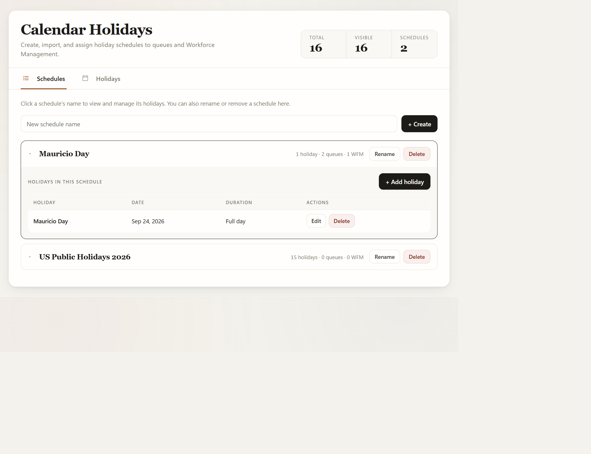

# Queue Holidays Manager for Dynamics 365


One screen to manage every holiday calendar behind your Omnichannel queues **and** Workforce Management — instead of clicking through Dataverse records one at a time.

[**Download the latest release →**](../../releases/latest)

---

## What is this? (in plain English)

If you run customer service queues in Dynamics 365 / Copilot Service, you can tell a queue "we're closed on these dates" using something called a **Holiday Schedule**. Out of the box, setting these up means digging through several different admin screens, creating records by hand, and there's no easy way to just say *"add all the public holidays for Canada this year"*.

This app fixes that. It's a single page inside your admin center where you can:

- 📅 **See every holiday** across every schedule in one filterable table
- 🌍 **Import a whole country's public holidays** in one click — 200+ countries, instead of typing each one by hand
- 🗓️ **Switch to a calendar view** and see the year laid out month by month
- ➕ **Add, edit, or delete** individual holidays as your business changes
- 🗂️ **Create, rename, or delete** whole Holiday Schedules, and see which queues use each one
- 🔗 **Assign a schedule to queues** — add or remove, without leaving the page
- 👥 **Apply the same holidays to Workforce Management**, so forecasting and scheduling respect them too
- 🧹 **Bulk-select and delete** holidays, with a confirmation step so nothing goes missing by accident

No coding, no PowerShell, no solution explorer — just a clean list you click around in.

---

## The three views

### Holidays

Every holiday across every schedule, filterable by **year, month, queue, WFM**, or free-text search. Separate **Queues** and **WFM** columns show exactly where each holiday applies, so anything unassigned is obvious at a glance.

Each filter also has a **"— Not applied —"** option, which turns the table into an audit tool: instantly list holidays that aren't wired to any queue, or any WFM record, yet.

### Schedules



Every Holiday Schedule, with a live count of its holidays, queues and WFM links. Click a schedule's name to **expand it in place** and manage its holidays directly. Rename and delete live here too.

### Calendar


A month grid of your holidays, colour-coded per schedule. Navigate with the arrows, the **Today** button, or the ← / → keys. Click any holiday to jump straight into editing it. The same Queue and WFM filters apply here.

---

## Workforce Management


WFM and queues can share a **single Holiday Schedule** — there's no need to maintain holidays twice.

Queues and WFM reach a schedule by different routes, and the app handles both:

| | How it points at a Holiday Schedule |
|---|---|
| **Queues** | `queue.msdyn_operatinghourid` → `msdyn_operatinghour.msdyn_calendarid` → business-hours `calendar` → `holidayschedulecalendarid` **lookup** |
| **WFM** | `msdyn_wemoperatinghours.msdyn_holidaycalendar` — a plain **string field holding the calendar's GUID** |

Because WFM stores a loose string rather than a real lookup, two things need care, and both are handled:

- **Re-linking on every change.** Each holiday edit rebuilds the parent schedule under a new calendar id (see below), so every linked WFM record is repointed to the new id in the same save. Without that, a WFM link would silently go stale after the very first edit.
- **No cascade on delete.** Dataverse won't clear a string field when the calendar it names is deleted, so deleting a schedule explicitly clears `msdyn_holidaycalendar` on every WFM record that referenced it — leaving no dangling ids.

---

## Technical details

### What it actually is

A single, self-contained HTML/CSS/JavaScript **web resource** for Dataverse. No external backend, no Azure Function, no build step, and **no CDN, script or font downloads** — so it works unchanged in locked-down environments. Every read and write goes straight to the standard Dataverse Web API (`/api/data/v9.2/...`) using the signed-in user's own session and security roles.

### What it reads and writes

| Concept | Dataverse entity | Notes |
|---|---|---|
| Holiday Schedule | `calendar` (`type = 2`) | Created, renamed and deleted directly. |
| Individual holiday | `calendarrule` (child of a `calendar`, `timecode = 2`) | See the caveat below. |
| Business-hours calendar | `calendar` (`type = 0`) | What a queue actually points at; its `holidayschedulecalendarid` links to the Holiday Schedule. |
| Queue link | `queue`, `msdyn_operatinghour` | Resolved and updated across the full chain. |
| WFM link | `msdyn_wemoperatinghours` | Single string field holding the schedule's GUID. |

### The `calendarrule` caveat

The Dataverse Web API does **not** support Retrieve, RetrieveMultiple, Update or Delete on `calendarrule`, and deep *update* is rejected too. The only supported write is a **deep insert** — embedding the rules inside the parent `calendar` on create.

So every holiday add, edit or delete works by rebuilding the whole parent schedule in one deep insert, re-linking its queues and WFM records, then deleting the old calendar. This is why re-linking matters so much, and why the app is careful about ordering.

### Reliability behaviour

- **Large environments** — queue and schedule queries follow `@odata.nextLink`, so environments with more than one page of records load completely instead of silently truncating.
- **Links are never silently dropped** — if any queue or WFM re-link fails (for example, insufficient privileges on that record), the old schedule is deliberately **not** deleted and the affected names are reported in the status bar. That prevents the silent failure where a queue quietly stops observing holidays.
- **Safe deletes** — deleting a schedule aborts with a clear message if any of its queues or WFM records can't be unlinked first.
- **Offline-tolerant** — calls to the public holiday API use a 6-second timeout. If a firewall blocks it, the app falls back to a built-in list and says so, rather than hanging.
- **Timezone-correct** — all dates are handled in UTC end to end, so a holiday never shifts by a day.

### Country import

Public holiday data comes from the free [Nager.Date API](https://date.nager.at/), called directly from the browser. It covers 200+ countries, with a built-in fallback list if the API is unreachable.

### Browser support / requirements

- Any modern browser that runs inside a Dataverse-hosted web resource (Edge / Chrome).
- The signed-in user needs read/write on `calendar`, `calendarrule`, `queue` and `msdyn_operatinghour` — the same privileges needed to manage queues manually today, which System Administrator and System Customizer already have. Assigning holidays to WFM additionally needs write access to `msdyn_wemoperatinghours`.
- No app registration, client secret, or external service to configure.

### Repo layout

```
solution/                            Dataverse solution source (what gets zipped for release)
  solution.xml
  customizations.xml
  [Content_Types].xml
  WebResources/
    qhol_queue_holidays_app.html     The entire app: HTML + CSS + JS in one file
scripts/
  build-solution-zip.ps1             Rebuilds the release .zip from solution/
```

---

## Installation

### 1. Import the solution

1. Download the latest `QueueHolidaysManager_x_x_x_x.zip` from the [Releases](../../releases/latest) page.
2. Go to **make.powerapps.com → Solutions → Import solution**.
3. Choose the `.zip` and click through the wizard. No connection references or configuration required.
4. You'll get one new web resource: **`qhol_queue_holidays_app.html`**.

The solution is **unmanaged**, so you can inspect or tweak the web resource after import.

### 2. Add it to the admin center navigation

1. Open the **Copilot Service admin center**.
2. Go to the site map editor for the app you want to add it to.
3. Pick the area/group where the link should appear.
4. Add a **Subarea**:
   - **Type:** `Web Resource`
   - **Web Resource:** `qhol_queue_holidays_app.html`
   - **Title:** `Queue Holidays`
   - **Icon:** any calendar-style icon
5. **Save** and **Publish**.

> Want to try it before wiring up navigation? Open it directly at
> `https://<yourorg>.crm.dynamics.com/WebResources/qhol_queue_holidays_app.html`

#### Why this step is manual

The Copilot Service admin center (`msdyn_CSAdminCenter`) is a **Microsoft-managed** app. Shipping a site map edit inside this solution would create an unmanaged layer over a Microsoft-owned component — which blocks future Microsoft updates to the admin center navigation and persists even after uninstalling this solution. Adding the subarea yourself keeps that change under your control and easy to reverse.

---

## Building the solution zip yourself

```powershell
# Edit solution/WebResources/qhol_queue_holidays_app.html, then:
./scripts/build-solution-zip.ps1
```

This regenerates the versioned `.zip` at the repo root, ready to import.

---

## License

MIT — see [LICENSE](LICENSE).
